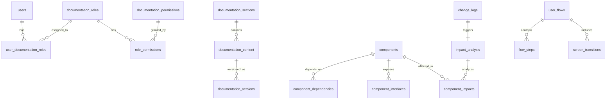

# Dokümantasyon Sistemi ER Diyagramı

## Genel Bakış

Bu dokümantasyon sistemi için tasarlanan veritabanı şeması, mevcut MediKariyer SQL Server yapısına uygun olarak tasarlanmıştır. Mevcut `users` tablosu ile entegre çalışacak şekilde foreign key ilişkileri kurulmuştur.

## Ana Tablolar

### 1. Dokümantasyon Tabloları
- `documentation_sections` - Dokümantasyon bölümleri
- `documentation_content` - Dokümantasyon içerikleri
- `documentation_versions` - Versiyon kontrolü

### 2. Bileşen Tabloları  
- `components` - Sistem bileşenleri
- `component_dependencies` - Bileşen bağımlılıkları
- `component_interfaces` - Bileşen arayüzleri

### 3. Kullanıcı Rolleri Tabloları
- `documentation_roles` - Dokümantasyon rolleri
- `documentation_permissions` - İzinler
- `role_permissions` - Rol-izin ilişkileri
- `user_documentation_roles` - Kullanıcı-rol atamaları

### 4. Etki Analizi Tabloları
- `impact_analysis` - Etki analizi kayıtları
- `change_logs` - Değişiklik logları
- `component_impacts` - Bileşen etkileri

### 5. Akış Haritaları Tabloları
- `user_flows` - Kullanıcı akışları
- `screen_transitions` - Ekran geçişleri
- `flow_steps` - Akış adımları

## ER Diyagram İlişkileri

## Detaylı Tablo İlişkileri

### Dokümantasyon Modülü
- `documentation_sections` (1) → (N) `documentation_content`
- `documentation_content` (1) → (N) `documentation_versions`
- `users` (1) → (N) `documentation_content` (created_by)
- `users` (1) → (N) `documentation_versions` (created_by)

### Bileşen Modülü
- `components` (1) → (N) `component_dependencies` (source_component)
- `components` (1) → (N) `component_dependencies` (target_component)
- `components` (1) → (N) `component_interfaces`
- `components` (1) → (N) `component_impacts`

### Rol Yönetimi Modülü
- `users` (1) → (N) `user_documentation_roles`
- `documentation_roles` (1) → (N) `user_documentation_roles`
- `documentation_roles` (1) → (N) `role_permissions`
- `documentation_permissions` (1) → (N) `role_permissions`

### Etki Analizi Modülü
- `change_logs` (1) → (1) `impact_analysis`
- `impact_analysis` (1) → (N) `component_impacts`
- `components` (1) → (N) `component_impacts`
- `users` (1) → (N) `change_logs` (created_by)

### Akış Haritaları Modülü
- `user_flows` (1) → (N) `flow_steps`
- `user_flows` (1) → (N) `screen_transitions`
- `documentation_roles` (1) → (N) `user_flows` (target_role)
- `users` (1) → (N) `user_flows` (created_by)

## Mevcut Sistem Entegrasyonu

Bu şema, mevcut MediKariyer sistemindeki aşağıdaki tablolarla entegre çalışacak şekilde tasarlanmıştır:

### Mevcut Tablolar (Referans)
- `users` - Ana kullanıcı tablosu
- `doctor_profiles` - Doktor profilleri
- `hospital_profiles` - Hastane profilleri
- `refresh_tokens` - Token yönetimi

### Entegrasyon Noktaları
- Tüm dokümantasyon tabloları `users.id` ile foreign key ilişkisi kurar
- Mevcut rol sistemi (`users.role`) ile dokümantasyon rolleri arasında mapping
- Mevcut audit log yapısı ile uyumlu `created_at`, `updated_at` alanları
- Mevcut soft delete pattern (`is_deleted`, `deleted_at`) kullanımı

## Naming Convention Uyumluluğu

Mevcut sistemdeki naming convention'lara uygun olarak:
- Tablo isimleri: snake_case (örn: `documentation_sections`)
- Kolon isimleri: snake_case (örn: `created_at`, `is_active`)
- Foreign key isimleri: `{table_name}_id` formatı
- Boolean alanlar: `is_` prefix'i ile
- Timestamp alanları: `_at` suffix'i ile