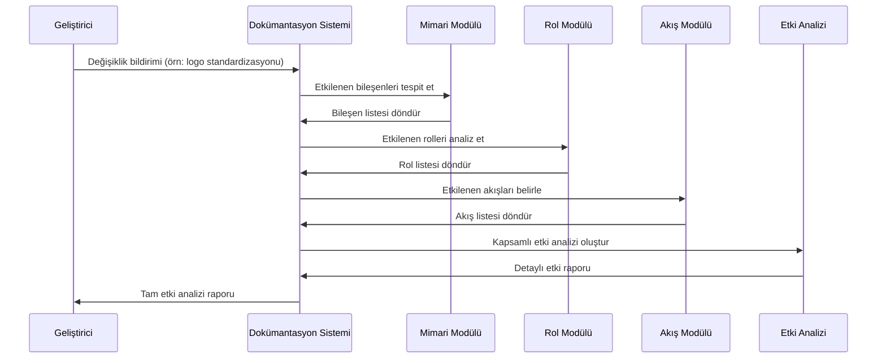
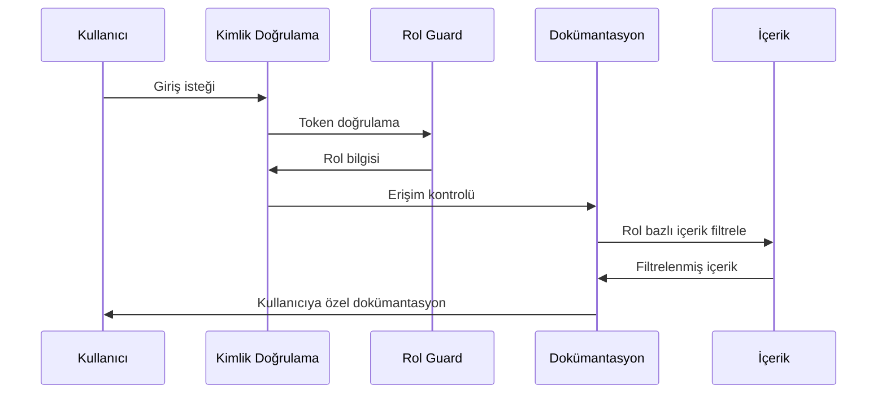

# Tasarım Dokümanı: Kapsamlı Dokümantasyon Sistemi

## Genel Bakış

MediKariyer sağlık sektörü platformu için kapsamlı bir dokümantasyon sistemi tasarlanmıştır. Bu sistem, proje mimarisi, kullanıcı rolleri, ekran akışları ve değişikliklerin etki analizini merkezi olarak yönetir. Sistem, Node.js/Express backend, React web frontend ve React Native mobile uygulamasından oluşan mevcut üç katmanlı mimariyi destekler ve değişikliklerin hangi bileşenleri etkilediğini takip etmeyi sağlar.

## Mimari

```mermaid
graph TD
    A[Dokümantasyon Sistemi] --> B[Proje Mimarisi Modülü]
    A --> C[Kullanıcı Rolleri Modülü]
    A --> D[Ekran Akışları Modülü]
    A --> E[Etki Analizi Modülü]
    A --> F[API Dokümantasyonu Modülü]
    A --> G[Kod Standartları Modülü]
    
    B --> B1[Backend Mimarisi]
    B --> B2[Frontend Mimarisi]
    B --> B3[Mobile Mimarisi]
    B --> B4[Bileşen İlişkileri]
    
    C --> C1[Admin Rolleri]
    C --> C2[Doktor Rolleri]
    C --> C3[Hastane Rolleri]
    C --> C4[Yetki Matrisi]
    
    D --> D1[Kullanıcı Akışları]
    D --> D2[Ekran Geçişleri]
    D --> D3[İş Süreçleri]
    D --> D4[Etkileşim Haritaları]
    
    E --> E1[Değişiklik Takibi]
    E --> E2[Etki Haritası]
    E --> E3[Bağımlılık Analizi]
    E --> E4[Risk Değerlendirmesi]
    
    F --> F1[Endpoint Dokümantasyonu]
    F --> F2[Veri Modelleri]
    F --> F3[Kimlik Doğrulama]
    F --> F4[Hata Kodları]
    
    G --> G1[Kod Yapısı Standartları]
    G --> G2[Dosya Organizasyonu]
    G --> G3[Naming Conventions]
    G --> G4[Best Practices]
```



## Sıralı Diyagramlar

### Ana Dokümantasyon Akışı



### Rol Bazlı Erişim Kontrolü Akışı



## Bileşenler ve Arayüzler

### Bileşen 1: Proje Mimarisi Yöneticisi

**Amaç**: Proje mimarisini ve bileşen ilişkilerini yönetir

**Arayüz**:
```typescript
interface ArchitectureManager {
  getProjectStructure(): ProjectStructure
  getComponentRelations(componentId: string): ComponentRelation[]
  updateArchitecture(changes: ArchitectureChange[]): void
  analyzeImpact(change: Change): ImpactAnalysis
}

interface ProjectStructure {
  backend: BackendStructure
  frontend: FrontendStructure
  mobile: MobileStructure
  shared: SharedComponents
}

interface ComponentRelation {
  sourceComponent: string
  targetComponent: string
  relationType: 'dependency' | 'inheritance' | 'composition' | 'usage'
  description: string
}
```

**Sorumluluklar**:
- Backend, frontend ve mobile katmanlarının yapısını takip etme
- Bileşenler arası bağımlılıkları yönetme
- Mimari değişikliklerin etkilerini analiz etme
- Katmanlar arası iletişimi dokümante etme

### Bileşen 2: Kullanıcı Rolleri Yöneticisi

**Amaç**: Kullanıcı rollerini ve yetkilerini yönetir

**Arayüz**:
```typescript
interface RoleManager {
  getRoles(): UserRole[]
  getPermissions(roleId: string): Permission[]
  getRoleMatrix(): RolePermissionMatrix
  validateAccess(userId: string, resource: string, action: string): boolean
}

interface UserRole {
  id: string
  name: string
  description: string
  permissions: Permission[]
  restrictions: Restriction[]
}

interface Permission {
  resource: string
  actions: string[]
  conditions?: AccessCondition[]
}
```

**Sorumluluklar**:
- Admin, Doktor, Hastane rollerini tanımlama
- Yetki matrisini yönetme
- Erişim kontrolü kurallarını dokümante etme
- Rol bazlı özellik erişimini takip etme

### Bileşen 3: Ekran Akışları Yöneticisi

**Amaç**: Kullanıcı akışlarını ve ekran geçişlerini yönetir

**Arayüz**:
```typescript
interface FlowManager {
  getUserFlows(roleId: string): UserFlow[]
  getScreenTransitions(screenId: string): ScreenTransition[]
  getBusinessProcesses(): BusinessProcess[]
  analyzeFlowImpact(change: Change): FlowImpactAnalysis
}

interface UserFlow {
  id: string
  name: string
  description: string
  role: string
  steps: FlowStep[]
  screens: Screen[]
}

interface ScreenTransition {
  fromScreen: string
  toScreen: string
  trigger: string
  conditions: TransitionCondition[]
}
```

**Sorumluluklar**:
- Kullanıcı yolculuklarını haritalama
- Ekran geçişlerini dokümante etme
- İş süreçlerini tanımlama
- Akış değişikliklerinin etkilerini analiz etme

### Bileşen 4: Etki Analizi Motoru

**Amaç**: Değişikliklerin sistem genelindeki etkilerini analiz eder

**Arayüz**:
```typescript
interface ImpactAnalysisEngine {
  analyzeChange(change: Change): ImpactReport
  getDependencies(componentId: string): Dependency[]
  calculateRisk(impact: ImpactAnalysis): RiskAssessment
  generateReport(analysis: ImpactAnalysis): DetailedReport
}

interface Change {
  type: 'ui' | 'api' | 'database' | 'business-logic' | 'configuration'
  component: string
  description: string
  scope: 'minor' | 'major' | 'breaking'
}

interface ImpactReport {
  affectedComponents: ComponentImpact[]
  affectedRoles: RoleImpact[]
  affectedFlows: FlowImpact[]
  riskLevel: 'low' | 'medium' | 'high' | 'critical'
  recommendations: string[]
}
```

**Sorumluluklar**:
- Değişikliklerin kapsamını belirleme
- Etkilenen bileşenleri tespit etme
- Risk seviyesini değerlendirme
- Detaylı etki raporları oluşturma

## Veri Modelleri

### Model 1: Dokümantasyon Yapısı

```typescript
interface DocumentationStructure {
  id: string
  title: string
  version: string
  lastUpdated: Date
  sections: DocumentSection[]
  metadata: DocumentMetadata
}

interface DocumentSection {
  id: string
  title: string
  content: string
  type: 'architecture' | 'roles' | 'flows' | 'api' | 'standards'
  subsections: DocumentSection[]
  relatedComponents: string[]
}
```

**Doğrulama Kuralları**:
- Başlık en az 3, en fazla 100 karakter olmalı
- İçerik boş olamaz
- Versiyon semantic versioning formatında olmalı
- Son güncelleme tarihi geçerli bir tarih olmalı

### Model 2: Bileşen Modeli

```typescript
interface Component {
  id: string
  name: string
  type: 'backend' | 'frontend' | 'mobile' | 'shared'
  layer: 'presentation' | 'business' | 'data' | 'infrastructure'
  dependencies: ComponentDependency[]
  interfaces: ComponentInterface[]
  documentation: ComponentDocumentation
}

interface ComponentDependency {
  targetComponent: string
  dependencyType: 'hard' | 'soft' | 'optional'
  description: string
}
```

**Doğrulama Kuralları**:
- Bileşen adı benzersiz olmalı
- Tip ve katman geçerli değerlerden biri olmalı
- Döngüsel bağımlılık olmamalı
- Her bileşenin en az bir arayüzü olmalı

## Algoritmik Sözde Kod

### Ana İşleme Algoritması

```pascal
ALGORITHM processDocumentationRequest(request)
INPUT: request of type DocumentationRequest
OUTPUT: result of type DocumentationResponse

BEGIN
  ASSERT validateRequest(request) = true
  
  // Adım 1: İstek tipini belirle
  requestType ← determineRequestType(request)
  
  // Adım 2: İlgili modülleri yükle
  modules ← loadRequiredModules(requestType)
  
  // Adım 3: Veri toplama ve analiz
  FOR each module IN modules DO
    ASSERT moduleIsValid(module)
    
    moduleData ← module.processRequest(request)
    result.addModuleData(moduleData)
  END FOR
  
  // Adım 4: Sonuçları birleştir ve raporla
  finalResult ← consolidateResults(result)
  
  ASSERT finalResult.isComplete() AND finalResult.isValid()
  
  RETURN finalResult
END
```

**Ön Koşullar**:
- request geçerli ve doğrulanmış olmalı
- Gerekli modüller yüklenebilir durumda olmalı
- Sistem kaynaklarına erişim mevcut olmalı

**Son Koşullar**:
- Sonuç tam ve geçerli olmalı
- Tüm modül verileri dahil edilmiş olmalı
- İşlem durumu başarılı olarak işaretlenmiş olmalı

**Döngü Değişmezleri**:
- İşlenen tüm modüller geçerli durumda
- Sonuç nesnesi tutarlı durumda kalır

### Etki Analizi Algoritması

```pascal
ALGORITHM analyzeImpact(change)
INPUT: change of type Change
OUTPUT: impact of type ImpactAnalysis

BEGIN
  // Temel doğrulama
  IF change = null OR change = undefined THEN
    RETURN createErrorImpact("Geçersiz değişiklik")
  END IF
  
  // Etkilenen bileşenleri bul
  affectedComponents ← findAffectedComponents(change)
  
  // Her bileşen için etki analizi yap
  FOR each component IN affectedComponents DO
    componentImpact ← analyzeComponentImpact(component, change)
    impact.addComponentImpact(componentImpact)
    
    // Bağımlı bileşenleri de kontrol et
    dependencies ← getDependencies(component)
    FOR each dependency IN dependencies DO
      IF isAffectedByChange(dependency, change) THEN
        dependencyImpact ← analyzeComponentImpact(dependency, change)
        impact.addComponentImpact(dependencyImpact)
      END IF
    END FOR
  END FOR
  
  // Risk seviyesini hesapla
  riskLevel ← calculateRiskLevel(impact)
  impact.setRiskLevel(riskLevel)
  
  RETURN impact
END
```

**Ön Koşullar**:
- change parametresi null olmayan geçerli bir Change nesnesi
- Bileşen bağımlılık haritası güncel durumda
- Risk hesaplama fonksiyonları mevcut

**Son Koşullar**:
- Döndürülen impact nesnesi tam ve tutarlı
- Tüm etkilenen bileşenler dahil edilmiş
- Risk seviyesi doğru hesaplanmış

**Döngü Değişmezleri**:
- İşlenen tüm bileşenler geçerli durumda
- Impact nesnesi her iterasyonda tutarlı kalır
- Döngüsel bağımlılıklar tespit edilir ve işlenir

## Anahtar Fonksiyonlar ile Formal Spesifikasyonlar

### Fonksiyon 1: generateImpactReport()

```typescript
function generateImpactReport(change: Change): ImpactReport
```

**Ön Koşullar**:
- `change` null olmayan geçerli bir Change nesnesi
- `change.component` mevcut bir bileşeni referans ediyor
- `change.type` geçerli değişiklik tiplerinden biri
- Sistem bileşen haritası güncel durumda

**Son Koşullar**:
- Döndürülen ImpactReport tam ve geçerli
- Tüm etkilenen bileşenler raporda yer alıyor
- Risk seviyesi doğru hesaplanmış
- Öneriler listesi boş değil

**Döngü Değişmezleri**: N/A (fonksiyon döngü içermiyor)

### Fonksiyon 2: validateUserAccess()

```typescript
function validateUserAccess(userId: string, resource: string, action: string): boolean
```

**Ön Koşullar**:
- `userId` geçerli bir kullanıcı ID'si
- `resource` mevcut bir kaynak adı
- `action` geçerli eylem tiplerinden biri
- Kullanıcı rol bilgileri güncel

**Son Koşullar**:
- Boolean değer döndürülür
- `true` döndürülürse kullanıcının erişim hakkı var
- `false` döndürülürse kullanıcının erişim hakkı yok
- Erişim kontrolü logları güncellenir

**Döngü Değişmezleri**: N/A (fonksiyon döngü içermiyor)

### Fonksiyon 3: updateDocumentation()

```typescript
function updateDocumentation(sectionId: string, content: string, userId: string): UpdateResult
```

**Ön Koşullar**:
- `sectionId` mevcut bir dokümantasyon bölümünü referans ediyor
- `content` boş olmayan geçerli içerik
- `userId` geçerli ve yetkili bir kullanıcı ID'si
- Kullanıcının güncelleme yetkisi var

**Son Koşullar**:
- Dokümantasyon başarıyla güncellenir
- Versiyon numarası artırılır
- Güncelleme geçmişi kaydedilir
- İlgili kullanıcılara bildirim gönderilir

**Döngü Değişmezleri**: N/A (fonksiyon döngü içermiyor)

## Kullanım Örnekleri

```typescript
// Örnek 1: Logo standardizasyonu değişikliği analizi
const logoChange: Change = {
  type: 'ui',
  component: 'shared-assets',
  description: 'Logo standardizasyonu - tüm platformlarda yeni logo kullanımı',
  scope: 'major'
}

const impactReport = generateImpactReport(logoChange)
console.log(`Etkilenen bileşen sayısı: ${impactReport.affectedComponents.length}`)
console.log(`Risk seviyesi: ${impactReport.riskLevel}`)

// Örnek 2: Kullanıcı erişim kontrolü
const hasAccess = validateUserAccess('doctor123', 'patient-records', 'read')
if (hasAccess) {
  // Hasta kayıtlarına erişim izni ver
  displayPatientRecords()
} else {
  // Erişim reddedildi mesajı göster
  showAccessDeniedMessage()
}

// Örnek 3: Dokümantasyon güncelleme
const updateResult = updateDocumentation(
  'api-endpoints',
  'Yeni hasta kayıt endpoint\'i eklendi: POST /api/patients',
  'admin456'
)

if (updateResult.success) {
  notifyTeam('API dokümantasyonu güncellendi')
}
```

## Doğruluk Özellikleri

Sistem aşağıdaki evrensel niceleyici ifadelerini sağlamalıdır:

**Özellik 1: Bütünlük Garantisi**
```
∀ change ∈ Changes, ∀ component ∈ Components:
  isAffected(component, change) ⟹ 
  component ∈ generateImpactReport(change).affectedComponents
```

**Özellik 2: Erişim Kontrolü Tutarlılığı**
```
∀ user ∈ Users, ∀ resource ∈ Resources, ∀ action ∈ Actions:
  validateUserAccess(user.id, resource, action) = true ⟺
  hasPermission(user.role, resource, action) = true
```

**Özellik 3: Dokümantasyon Sürüm Tutarlılığı**
```
∀ doc ∈ Documents:
  updateDocumentation(doc.id, newContent, userId) ⟹
  doc.version > doc.previousVersion ∧ doc.lastUpdated = now()
```

**Özellik 4: Bağımlılık Geçişkenliği**
```
∀ A, B, C ∈ Components:
  dependsOn(A, B) ∧ dependsOn(B, C) ⟹ 
  indirectlyAffects(C, A) = true
```

## Hata İşleme

### Hata Senaryosu 1: Geçersiz Değişiklik Bildirimi

**Durum**: Kullanıcı eksik veya hatalı değişiklik bilgisi gönderir
**Yanıt**: Doğrulama hatası döndürülür ve kullanıcıdan eksik bilgileri tamamlaması istenir
**Kurtarma**: Kullanıcı formu düzeltir ve tekrar gönderir

### Hata Senaryosu 2: Yetkisiz Erişim Denemesi

**Durum**: Kullanıcı yetkisi olmayan bir dokümantasyon bölümüne erişmeye çalışır
**Yanıt**: 403 Forbidden hatası döndürülür ve erişim reddedilir
**Kurtarma**: Kullanıcı uygun yetkiye sahip hesapla giriş yapar

### Hata Senaryosu 3: Sistem Kaynak Yetersizliği

**Durum**: Büyük etki analizi işlemi sistem kaynaklarını aşar
**Yanıt**: İşlem parçalara bölünür ve aşamalı olarak işlenir
**Kurtarma**: Sistem otomatik olarak yük dengeleme yapar

## Test Stratejisi

### Birim Test Yaklaşımı

Her bileşen için ayrı test suitleri oluşturulur. Ana test alanları:
- Etki analizi algoritmaları
- Rol bazlı erişim kontrolü
- Dokümantasyon güncelleme işlemleri
- Bileşen bağımlılık analizi

### Özellik Tabanlı Test Yaklaşımı

**Özellik Test Kütüphanesi**: fast-check (TypeScript/JavaScript için)

Aşağıdaki özellikler için property-based testler yazılır:
- Etki analizi sonuçlarının tutarlılığı
- Erişim kontrolü kurallarının geçişkenliği
- Dokümantasyon versiyonlama mantığı
- Bileşen bağımlılık döngülerinin tespiti

### Entegrasyon Test Yaklaşımı

Sistem bileşenleri arasındaki etkileşimler test edilir:
- API endpoint'leri ile frontend bileşenleri arasındaki veri akışı
- Rol değişikliklerinin tüm katmanlarda yansıması
- Gerçek zamanlı güncelleme bildirimlerinin çalışması

## Performans Değerlendirmeleri

Sistem aşağıdaki performans gereksinimlerini karşılamalıdır:
- Etki analizi işlemleri 5 saniye içinde tamamlanmalı
- Dokümantasyon sayfaları 2 saniye içinde yüklenmeli
- Eş zamanlı 100 kullanıcıyı desteklemeli
- Veri tabanı sorguları 1 saniye içinde yanıt vermeli

## Güvenlik Değerlendirmeleri

Sistem aşağıdaki güvenlik önlemlerini içerir:
- JWT tabanlı kimlik doğrulama
- Rol bazlı erişim kontrolü (RBAC)
- API rate limiting
- Girdi doğrulama ve sanitizasyon
- Audit logging tüm kritik işlemler için
- HTTPS zorunluluğu
- XSS ve CSRF koruması

## Bağımlılıklar

### Backend Bağımlılıklar
- Node.js (>=18.0.0)
- Express.js framework
- JWT kimlik doğrulama
- SQL Server veritabanı
- Winston logging

### Frontend Bağımlılıklar
- React (^18.2.0)
- TypeScript
- Tailwind CSS
- React Router
- Axios HTTP client
- React Query

### Mobile Bağımlılıklar
- React Native
- Expo platform
- Native navigation
- AsyncStorage
- Push notifications

### Geliştirme Araçları
- ESLint kod kalitesi
- Prettier kod formatı
- Jest test framework
- Cypress E2E testler
- Vite build tool