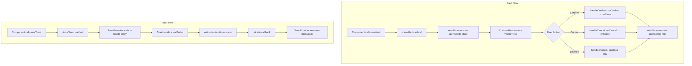

# Design Document: UI Overlay System Refactor

## Overview

This design document describes the architecture for a deterministic, production-grade UI overlay system in React Native. The system eliminates global mutable state, ensures reliable callback execution, and provides predictable overlay behavior across Alert, Toast, Modal, and Select components.

The refactored architecture follows these core principles:
- **Context + Hooks Only**: All state management through React Context
- **Single Source of Truth**: Providers own overlay state; components are stateless renderers
- **Explicit Callbacks**: Clear separation between user intent (onConfirm/onCancel) and cleanup (onClose)
- **Centralized Z-Index**: All overlays respect the unified stacking system
- **No Timing Hacks**: No setTimeout/requestAnimationFrame for behavior fixes

## Architecture

### Provider Hierarchy

The overlay system maintains a strict provider hierarchy that must not be modified:

```
GestureHandlerRootView
└── SafeAreaProvider
    └── PortalProvider
        └── BottomSheetModalProvider (ROOT LEVEL - singleton)
            └── AppProviders
                └── QueryClientProvider
                    └── ThemeProvider
                        └── AlertProvider
                            └── ToastProvider
                                └── NavigationContainer
                                    └── Screens
        └── PortalHost (name="root") ← Toast renders here via Portal
```

### State Flow Diagram



## Components and Interfaces

### AlertContext Interface

```typescript
interface AlertConfig {
  type: AlertType;
  title: string;
  message: string;
  onConfirm?: () => void;
  onCancel?: () => void;
  confirmText?: string;
  cancelText?: string;
}

interface AlertContextType {
  showAlert: (config: AlertConfig) => void;
  hideAlert: () => void;
  isVisible: boolean;
}

type AlertType = 'success' | 'error' | 'info' | 'confirm' | 'confirmDestructive';
```

### AlertProvider Implementation

```typescript
// Key design decisions:
// 1. No global handler - context only
// 2. Callback refs to prevent stale closures
// 3. Execution guard to prevent double-firing

interface AlertProviderState {
  config: AlertConfig | null;
  isExecuting: boolean; // Guard against rapid clicks
}

const AlertProvider: React.FC<PropsWithChildren> = ({ children }) => {
  const [state, setState] = useState<AlertProviderState>({
    config: null,
    isExecuting: false,
  });
  
  // Store callbacks in refs to avoid stale closure issues
  const callbacksRef = useRef<{
    onConfirm?: () => void;
    onCancel?: () => void;
  }>({});

  const showAlert = useCallback((config: AlertConfig) => {
    // Store callbacks in ref
    callbacksRef.current = {
      onConfirm: config.onConfirm,
      onCancel: config.onCancel,
    };
    setState({ config, isExecuting: false });
  }, []);

  const hideAlert = useCallback(() => {
    callbacksRef.current = {};
    setState({ config: null, isExecuting: false });
  }, []);

  const handleConfirm = useCallback(() => {
    if (state.isExecuting) return; // Guard
    setState(prev => ({ ...prev, isExecuting: true }));
    
    try {
      callbacksRef.current.onConfirm?.();
    } catch (error) {
      if (__DEV__) console.error('Alert onConfirm error:', error);
    }
    hideAlert();
  }, [state.isExecuting, hideAlert]);

  const handleCancel = useCallback(() => {
    if (state.isExecuting) return; // Guard
    setState(prev => ({ ...prev, isExecuting: true }));
    
    try {
      callbacksRef.current.onCancel?.();
    } catch (error) {
      if (__DEV__) console.error('Alert onCancel error:', error);
    }
    hideAlert();
  }, [state.isExecuting, hideAlert]);

  return (
    <AlertContext.Provider value={{ showAlert, hideAlert, isVisible: !!state.config }}>
      {children}
      {state.config && (
        <CustomAlert
          visible={true}
          type={state.config.type}
          title={state.config.title}
          message={state.config.message}
          onConfirm={handleConfirm}
          onCancel={handleCancel}
          confirmText={state.config.confirmText}
          cancelText={state.config.cancelText}
        />
      )}
    </AlertContext.Provider>
  );
};
```

### useAlert Hook

```typescript
export const useAlert = (): AlertContextType => {
  const context = useContext(AlertContext);
  
  if (!context) {
    throw new Error(
      'useAlert must be used within AlertProvider. ' +
      'Ensure AlertProvider is in your component tree.'
    );
  }
  
  return context;
};
```

### Alert Helper Utilities (No Global State)

```typescript
// alert.helpers.ts
// These are convenience wrappers - they require AlertProvider context

import { useAlert } from './AlertProvider';

// Hook-based helpers for use in components
export const useAlertHelpers = () => {
  const { showAlert } = useAlert();

  return {
    success: (message: string, onConfirm?: () => void) => {
      showAlert({
        type: 'success',
        title: 'Başarılı',
        message,
        onConfirm,
        confirmText: 'Tamam',
      });
    },

    error: (message: string, onConfirm?: () => void) => {
      showAlert({
        type: 'error',
        title: 'Hata',
        message,
        onConfirm,
        confirmText: 'Tamam',
      });
    },

    info: (message: string, onConfirm?: () => void) => {
      showAlert({
        type: 'info',
        title: 'Bilgi',
        message,
        onConfirm,
        confirmText: 'Tamam',
      });
    },

    confirm: (
      message: string,
      onConfirm: () => void,
      onCancel?: () => void,
      options?: { title?: string; confirmText?: string; cancelText?: string }
    ) => {
      showAlert({
        type: 'confirm',
        title: options?.title ?? 'Emin misiniz?',
        message,
        onConfirm,
        onCancel,
        confirmText: options?.confirmText ?? 'Onayla',
        cancelText: options?.cancelText ?? 'İptal',
      });
    },

    confirmDestructive: (
      title: string,
      message: string,
      onConfirm: () => void,
      onCancel?: () => void,
      confirmText = 'Sil'
    ) => {
      showAlert({
        type: 'confirmDestructive',
        title,
        message,
        onConfirm,
        onCancel,
        confirmText,
        cancelText: 'İptal',
      });
    },
  };
};
```

### Imperative Alert API (For Non-Component Code)

For cases where alerts need to be triggered from non-component code (API interceptors, etc.), we provide a ref-based approach:

```typescript
// alertRef.ts
import { createRef } from 'react';
import { Alert } from 'react-native';

interface AlertRef {
  showAlert: (config: AlertConfig) => void;
  hideAlert: () => void;
}

export const alertRef = createRef<AlertRef>();

// Fallback to native Alert when ref not available
export const imperativeAlert = {
  success: (message: string, onConfirm?: () => void) => {
    if (alertRef.current) {
      alertRef.current.showAlert({
        type: 'success',
        title: 'Başarılı',
        message,
        onConfirm,
        confirmText: 'Tamam',
      });
    } else {
      Alert.alert('Başarılı', message, [{ text: 'Tamam', onPress: onConfirm }]);
    }
  },
  // ... other methods
};

// In AlertProvider, expose ref
useImperativeHandle(alertRef, () => ({
  showAlert,
  hideAlert,
}), [showAlert, hideAlert]);
```

### ToastProvider Implementation

```typescript
interface ToastData {
  id: string;
  message: string;
  type: ToastType;
  duration: number;
}

interface ToastContextType {
  showToast: (message: string, type?: ToastType, duration?: number) => void;
}

const ToastProvider: React.FC<PropsWithChildren> = ({ children }) => {
  const [toasts, setToasts] = useState<ToastData[]>([]);
  const timersRef = useRef<Map<string, NodeJS.Timeout>>(new Map());
  const insets = useSafeAreaInsets();

  // Cleanup all timers on unmount
  useEffect(() => {
    return () => {
      timersRef.current.forEach(timer => clearTimeout(timer));
      timersRef.current.clear();
    };
  }, []);

  const showToast = useCallback((
    message: string,
    type: ToastType = 'info',
    duration: number = 3000
  ) => {
    const id = `toast-${Date.now()}-${Math.random().toString(36).substr(2, 9)}`;
    
    setToasts(prev => [...prev, { id, message, type, duration }]);
    
    // Set auto-dismiss timer
    const timer = setTimeout(() => {
      hideToast(id);
    }, duration);
    
    timersRef.current.set(id, timer);
  }, []);

  const hideToast = useCallback((id: string) => {
    // Clear timer if exists
    const timer = timersRef.current.get(id);
    if (timer) {
      clearTimeout(timer);
      timersRef.current.delete(id);
    }
    
    setToasts(prev => prev.filter(toast => toast.id !== id));
  }, []);

  return (
    <ToastContext.Provider value={{ showToast }}>
      {children}
      <Portal hostName="root">
        <View 
          style={[styles.container, { top: insets.top + 10 }]}
          pointerEvents="box-none"
        >
          {toasts.map(toast => (
            <Toast
              key={toast.id}
              message={toast.message}
              type={toast.type}
              duration={toast.duration}
              onHide={() => hideToast(toast.id)}
            />
          ))}
        </View>
      </Portal>
    </ToastContext.Provider>
  );
};
```

### CustomAlert Component (Stateless)

```typescript
interface CustomAlertProps {
  visible: boolean;
  type: AlertType;
  title: string;
  message: string;
  onConfirm: () => void;  // Required - handled by provider
  onCancel: () => void;   // Required - handled by provider
  confirmText?: string;
  cancelText?: string;
}

// Component is purely presentational
// All callback logic is in AlertProvider
const CustomAlert: React.FC<CustomAlertProps> = ({
  visible,
  type,
  title,
  message,
  onConfirm,
  onCancel,
  confirmText = 'Tamam',
  cancelText = 'İptal',
}) => {
  const scaleAnim = useRef(new Animated.Value(0)).current;
  const isConfirmType = type === 'confirm' || type === 'confirmDestructive';

  useEffect(() => {
    if (visible) {
      Animated.spring(scaleAnim, {
        toValue: 1,
        useNativeDriver: true,
        tension: 50,
        friction: 7,
      }).start();
    } else {
      scaleAnim.setValue(0);
    }
  }, [visible]);

  return (
    <Modal
      visible={visible}
      transparent
      animationType="fade"
      onRequestClose={isConfirmType ? onCancel : onConfirm}
      statusBarTranslucent
    >
      {/* ... render UI ... */}
      <View style={styles.buttonContainer}>
        {isConfirmType ? (
          <>
            <Button label={cancelText} onPress={onCancel} variant="outline" />
            <Button label={confirmText} onPress={onConfirm} variant="primary" />
          </>
        ) : (
          <Button label={confirmText} onPress={onConfirm} variant="gradient" />
        )}
      </View>
    </Modal>
  );
};
```

## Data Models

### Alert Configuration

```typescript
interface AlertConfig {
  type: AlertType;
  title: string;
  message: string;
  onConfirm?: () => void;
  onCancel?: () => void;
  confirmText?: string;
  cancelText?: string;
}

type AlertType = 'success' | 'error' | 'info' | 'confirm' | 'confirmDestructive';
```

### Toast Configuration

```typescript
interface ToastData {
  id: string;           // Unique identifier
  message: string;      // Display message
  type: ToastType;      // Visual style
  duration: number;     // Auto-dismiss time in ms
}

type ToastType = 'success' | 'error' | 'warning' | 'info';
```

### Z-Index Configuration

```typescript
const zIndex = {
  base: 0,
  elevated: 1,
  sticky: 10,
  fab: 15,
  dropdown: 100,
  select: 100,
  bottomSheet: 200,
  actionSheet: 200,
  modal: 300,
  dialog: 300,
  alert: 400,
  toast: 500,
  overlay: 600,
  loading: 600,
  offlineNotice: 700,
  max: 9999,
} as const;
```


## Correctness Properties

*A property is a characteristic or behavior that should hold true across all valid executions of a system—essentially, a formal statement about what the system should do. Properties serve as the bridge between human-readable specifications and machine-verifiable correctness guarantees.*

Based on the prework analysis, the following properties have been identified and consolidated to eliminate redundancy:

### Property 1: Alert Context Availability

*For any* component rendered within AlertProvider, calling useAlert SHALL return an object containing showAlert and hideAlert methods that are callable functions.

**Validates: Requirements 1.1, 1.4**

### Property 2: No Global State Dependency

*For any* AlertProvider instance, the alert system SHALL function correctly without any global mutable variables being set, and multiple AlertProvider instances SHALL NOT interfere with each other's state.

**Validates: Requirements 1.2**

### Property 3: Hook Outside Provider Error

*For any* call to useAlert or useToast outside their respective providers, the hook SHALL throw an Error with a message containing the provider name and guidance for resolution.

**Validates: Requirements 1.3, 5.2, 9.1**

### Property 4: Alert Type Support

*For any* AlertType value in the set {success, error, info, confirm, confirmDestructive}, calling showAlert with that type SHALL render an alert with the corresponding icon and color configuration.

**Validates: Requirements 1.6**

### Property 5: Callback Single Execution

*For any* alert with onConfirm and/or onCancel callbacks, when the user triggers the corresponding action (even with rapid repeated interactions), the callback SHALL be executed exactly once.

**Validates: Requirements 2.1, 2.2, 2.6**

### Property 6: Missing Callback Handling

*For any* alert configuration where onConfirm or onCancel is undefined, the alert SHALL close without throwing an error when the corresponding button is pressed.

**Validates: Requirements 2.5**

### Property 7: Provider Cleanup on Unmount

*For any* AlertProvider or ToastProvider that unmounts while overlays are visible or timers are pending, all state SHALL be cleaned up and no memory leaks or timer errors SHALL occur.

**Validates: Requirements 3.1, 4.6**

### Property 8: Alert Replacement Behavior

*For any* sequence of showAlert calls while an alert is already visible, the system SHALL replace the current alert with the new configuration, maintaining a single visible alert at any time.

**Validates: Requirements 3.6**

### Property 9: Toast Auto-Dismiss

*For any* toast shown with a duration D, the toast SHALL be automatically removed from the visible toasts array after D milliseconds (±100ms tolerance for timing).

**Validates: Requirements 4.2**

### Property 10: Toast Stacking

*For any* sequence of N toasts shown in rapid succession, all N toasts SHALL be visible simultaneously and arranged vertically without overlapping each other.

**Validates: Requirements 4.3**

### Property 11: Toast Type Support

*For any* ToastType value in the set {success, error, warning, info}, calling showToast with that type SHALL render a toast with the corresponding icon and color from the theme.

**Validates: Requirements 4.5**

### Property 12: Toast Unique IDs

*For any* sequence of showToast calls, each toast SHALL receive a unique identifier, and no two toasts in the active toasts array SHALL have the same ID.

**Validates: Requirements 5.4**

### Property 13: Z-Index Stacking Order

*For any* combination of visible overlays, the z-index values SHALL satisfy: base < dropdown < bottomSheet < modal < alert < toast, ensuring correct visual stacking.

**Validates: Requirements 7.1, 7.2, 7.3, 7.4, 7.5**

### Property 14: Helper Utilities API

*For any* helper utility method (success, error, info, confirm, confirmDestructive), the method SHALL accept the documented parameters and pass callbacks through to showAlert without modification.

**Validates: Requirements 8.1, 8.4**

### Property 15: Callback Validation

*For any* callback parameter passed to showAlert, the system SHALL validate it is a function (or undefined) before attempting to call it, preventing runtime type errors.

**Validates: Requirements 9.4**

### Property 16: Callback Error Handling

*For any* callback that throws an error during execution, the system SHALL catch the error, log it in development mode, and continue with the alert dismissal without crashing.

**Validates: Requirements 10.5**

### Property 17: Rapid Interaction Handling

*For any* sequence of rapid show/hide calls to the alert or toast system, the final state SHALL reflect the last operation in the sequence without race conditions or inconsistent state.

**Validates: Requirements 10.3**

### Property 18: Animation Cleanup

*For any* overlay component that unmounts during an active animation, the animation SHALL be cancelled and no state updates SHALL be attempted on the unmounted component.

**Validates: Requirements 10.6**

## Error Handling

### Alert System Errors

| Error Scenario | Handling Strategy |
|----------------|-------------------|
| useAlert outside provider | Throw descriptive Error with provider name |
| Callback throws error | Catch, log in dev mode, continue dismissal |
| Invalid callback type | Validate before calling, skip if not function |
| Rapid button presses | Guard with isExecuting flag, ignore subsequent |
| Unmount during animation | Cancel animation, prevent state updates |

### Toast System Errors

| Error Scenario | Handling Strategy |
|----------------|-------------------|
| useToast outside provider | Throw descriptive Error with provider name |
| Timer cleanup on unmount | Clear all timers in useEffect cleanup |
| Invalid toast type | Default to 'info' type |
| Portal host not found | Log warning, render inline as fallback |

### Development Warnings

```typescript
// Development-only logging
const devLog = (message: string, data?: unknown) => {
  if (__DEV__) {
    console.log(`[Overlay System] ${message}`, data);
  }
};

const devWarn = (message: string, data?: unknown) => {
  if (__DEV__) {
    console.warn(`[Overlay System] ${message}`, data);
  }
};
```

## Testing Strategy

### Property-Based Testing

The system will use **fast-check** for property-based testing in JavaScript/TypeScript. Each correctness property will be implemented as a property-based test with minimum 100 iterations.

### Test Configuration

```typescript
import fc from 'fast-check';

// Configure fast-check for overlay system tests
const testConfig = {
  numRuns: 100,
  verbose: true,
  seed: Date.now(), // For reproducibility in CI
};
```

### Unit Tests

Unit tests will cover:
- Specific examples demonstrating correct behavior
- Edge cases (empty callbacks, rapid interactions)
- Error conditions (hook outside provider, invalid props)
- Integration points between components

### Test File Structure

```
mobile-app/src/
├── providers/
│   ├── AlertProvider.tsx
│   ├── AlertProvider.test.tsx      # Unit + Property tests
│   ├── ToastProvider.tsx
│   └── ToastProvider.test.tsx      # Unit + Property tests
├── components/ui/
│   ├── CustomAlert.tsx
│   ├── CustomAlert.test.tsx        # Unit tests
│   ├── Toast.tsx
│   └── Toast.test.tsx              # Unit tests
└── theme/
    ├── zIndex.ts
    └── zIndex.test.ts              # Property tests for ordering
```

### Test Tagging Convention

Each property test must be tagged with the design document property reference:

```typescript
describe('AlertProvider', () => {
  it('Property 5: Callback Single Execution - onConfirm called exactly once', () => {
    // Feature: ui-overlay-system-refactor, Property 5: Callback Single Execution
    fc.assert(
      fc.property(fc.nat(), (clickCount) => {
        // ... test implementation
      }),
      testConfig
    );
  });
});
```

## Anti-Patterns (Forbidden)

### ❌ Global Mutable State

```typescript
// FORBIDDEN - Do not use global handlers
let globalAlertHandler: AlertHandler | null = null;

export const setGlobalAlertHandler = (handler: AlertHandler | null) => {
  globalAlertHandler = handler; // ❌ Mutable global state
};
```

### ❌ Timing-Based Fixes

```typescript
// FORBIDDEN - Do not use setTimeout for behavior fixes
const handleConfirm = () => {
  setTimeout(() => {
    onConfirm?.(); // ❌ Timing hack
  }, 100);
};
```

### ❌ Business Logic in onClose

```typescript
// FORBIDDEN - onClose is for cleanup only
showAlert({
  type: 'confirm',
  message: 'Delete?',
  onClose: () => {
    deleteItem(); // ❌ Business logic in cleanup
    navigation.goBack(); // ❌ Side effects in cleanup
  },
});
```

### ❌ Local BottomSheetModalProvider

```typescript
// FORBIDDEN - Do not add local providers
const MyScreen = () => (
  <BottomSheetModalProvider> {/* ❌ Local provider */}
    <Select options={options} />
  </BottomSheetModalProvider>
);
```

## Correct Usage Examples

### Alert Usage

```typescript
// ✅ Correct - Using hook in component
const MyComponent = () => {
  const { showAlert } = useAlert();
  // OR use helper hook
  const alert = useAlertHelpers();

  const handleDelete = () => {
    alert.confirmDestructive(
      'Silme Onayı',
      'Bu kayıt kalıcı olarak silinecek.',
      () => {
        // Business logic in onConfirm
        deleteMutation.mutate(itemId);
      }
    );
  };

  return <Button onPress={handleDelete} label="Sil" />;
};
```

### Toast Usage

```typescript
// ✅ Correct - Using hook in component
const MyComponent = () => {
  const { showToast } = useToast();

  const handleSave = async () => {
    try {
      await saveMutation.mutateAsync(data);
      showToast('Kaydedildi', 'success');
    } catch (error) {
      showToast('Kaydetme başarısız', 'error');
    }
  };

  return <Button onPress={handleSave} label="Kaydet" />;
};
```

### Imperative Alert (Non-Component Code)

```typescript
// ✅ Correct - Using ref for imperative access
// In API interceptor or other non-component code
import { imperativeAlert } from '@/utils/alertRef';

axios.interceptors.response.use(
  response => response,
  error => {
    if (error.response?.status === 401) {
      imperativeAlert.error('Oturum süresi doldu');
    }
    return Promise.reject(error);
  }
);
```
